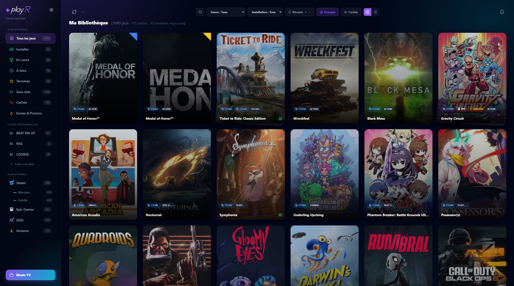
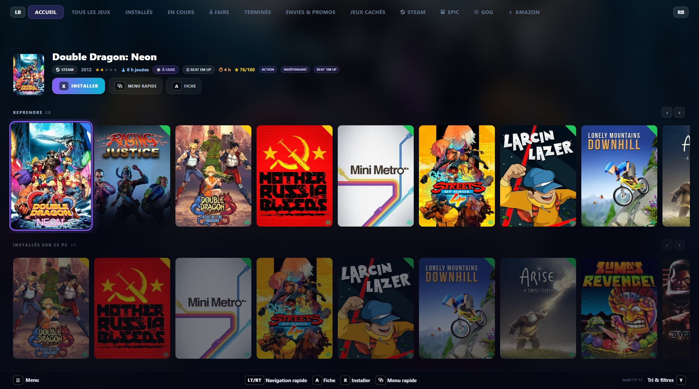

<div align="center">

# 🎮 playR

### Toute votre bibliothèque de jeux, réunie.

**Steam · Epic · GOG · Amazon** dans une seule interface élégante — navigable à la manette,
avec un **mode TV** plein écran, et un **serveur qui tourne chez vous**.

[⬇️ Télécharger](#-téléchargement) · [🖥️ Installer un serveur](#-installer-un-serveur) · [🔑 Connecter ses comptes](#-connecter-ses-comptes)



</div>

---

## ✨ Ce que ça fait

- **Plusieurs plateformes, une seule bibliothèque** — Steam (bibliothèque **famille** incluse), Epic, GOG, Amazon, avec regroupement des jeux similaires.
- **Jouer & installer** — installez et lancez vos jeux directement depuis votre bibliothèque.
- **Envies & Promos** — vos wishlists Steam et GOG, avec les prix et promotions comparés sur Steam, GOG, Epic, Kinguin et une trentaine de boutiques.
- **Fiches enrichies** — jaquettes, description, note critique, durée de jeu, configuration requise, temps joué (**IGDB**, **HowLongToBeat**).
- **Mode TV** — plein écran à la manette, sur la télé du salon comme sur votre écran de PC.
- **Notes, listes & statuts** — notez, créez vos listes, marquez à faire / en cours / terminé, masquez ce qui vous encombre.
- **9 langues** — français, anglais, allemand, espagnol, italien, portugais, néerlandais, polonais, russe, japonais.
- **100 % manette** — navigation complète manette, clavier et souris.
- **Auto-hébergé & privé** — votre serveur tourne chez vous. Vos données restent à vous.

<div align="center">



</div>

---

## 🧭 Comment ça marche

playR = **un serveur** (héberge la bibliothèque) + **des clients** (les PC qui s'y connectent).

1. **Le serveur** tourne sur un PC, un CasaOS, un NAS ou un Proxmox.
2. **Le client** (app Windows) se connecte à l'adresse du serveur (ex. `192.168.1.10:3000`).
3. Chacun **connecte ses comptes** (Steam, Epic…) et synchronise.

---

## 💾 Téléchargement

**Windows — un seul installeur, deux lanceurs.**

➡️ **[Télécharger `playR-Setup.exe`](https://github.com/ixelia-fr/playR-releases/releases/latest)**

**L'installeur ne pose aucune question** : il pose l'application et le serveur, et au premier
lancement playR cherche votre bibliothèque — sur ce PC comme sur le réseau — et vous la fait
confirmer.

> Windows peut afficher « éditeur inconnu » → *Informations complémentaires* → *Exécuter quand même*.
> L'application se met à jour toute seule, serveur compris.

---

## 🖥️ Installer un serveur

Le serveur est une **image Docker** → il tourne partout.

### CasaOS
**App Store** → *Installer une app personnalisée* → icône **Importer** (en haut à droite) → collez [`docker-compose.yml`](docker-compose.yml) → **Envoyer** → **Installer** → **Ouvrir**.
(Détails pas à pas dans la [doc](https://playrgameslauncher.com/docs.html#casaos).)

### NAS / Synology / Proxmox / Docker
```bash
mkdir -p /DATA/AppData/playr/data
docker compose up -d      # avec le docker-compose.yml fourni
```
> Sur **Proxmox** : un conteneur LXC avec Docker, ou une petite VM Docker.
> Mise à jour : `docker compose pull && docker compose up -d`.

Adresse à donner aux clients : `http://[IP-de-la-machine]:3000`.

> ⚠️ L'image `ghcr.io/ixelia-fr/playr` doit être **publique** pour être téléchargeable.

---

## 🔑 Connecter ses comptes

Chaque serveur démarre **vide** : vous connectez **vos propres** comptes dans **⚙ Paramètres**.

| Service | Ce qu'il faut |
|---|---|
| **Steam** | Connexion Steam (Connector, famille incluse) — ou SteamID + clé API |
| **Epic** | Code d'autorisation (OAuth) |
| **GOG** | Identifiant GOG |
| **Amazon** | Un bouton dans l'app (l'appli Amazon Games doit être installée sur ce PC) |
| **Jaquettes & métadonnées** | **Rien — c'est inclus** (IGDB, HowLongToBeat) |

Guide détaillé : [`docs/CONNEXIONS.md`](../docs/CONNEXIONS.md).

---

<div align="center">
<sub>playR — votre bibliothèque de jeux auto-hébergée.</sub>
</div>
